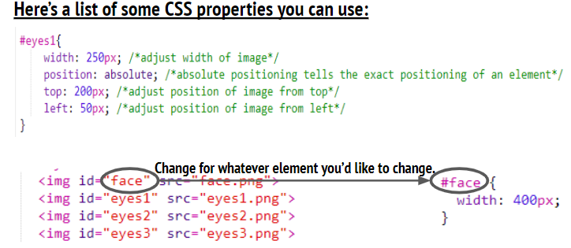
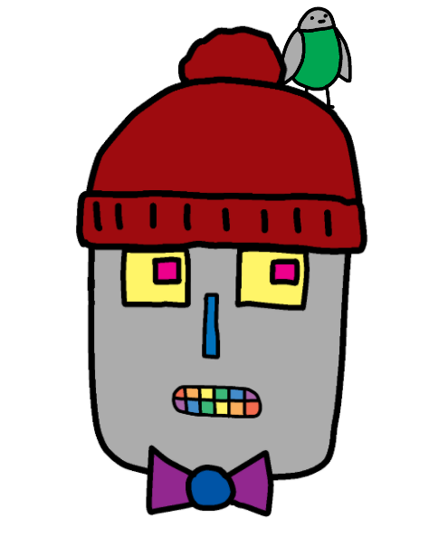

# 💻 Introduction to HTML and CSS 

You  will explore the two core languages that are used to build web pages; Hypertext Markup Language (HTML) and Cascading Style Sheets (CSS).

## ✅ Learning Outcomes: Exercise 1.5

> *By completing this exercise you will have experienced the following:*

* Understanding the importance of order of code.
* Gain a deeper understanding how HTML and CSS are connected.
* Introduced to the positioning properties of CSS; top and left. 
* Introduced to changing the size of an image; width.

 

---

## 🎯 Exercise 1.5:  Make A Robot

* You will about the importance of code being in order. As well as how HTML and CSS are connected. 

*  Edit the **style.css** edit the code to create your own robot, **be creative** 

🆘 **Use the CSS Code to help you **

---
Your final webpage should look something like this:

# ⏭️ Next Lesson
* In the next lesson you will apply your knowledge of HTML and CSS to create your very own “project showcase” website.
  